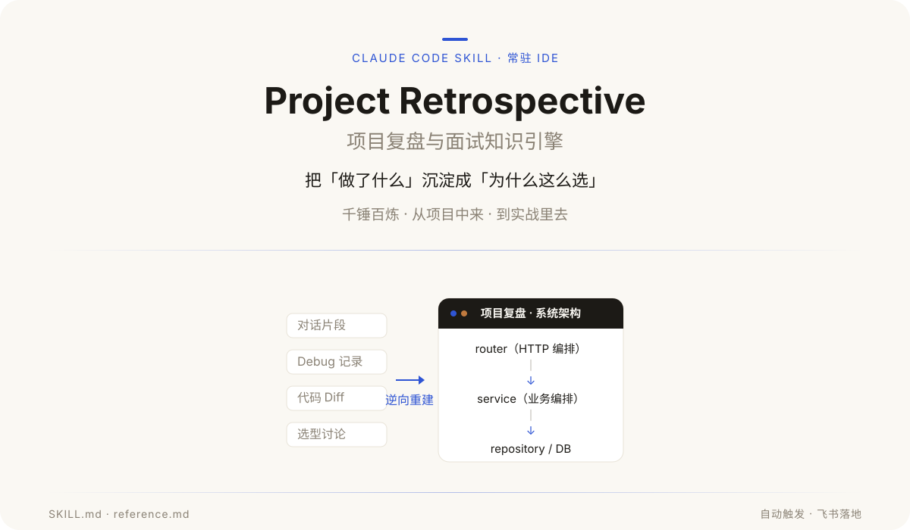
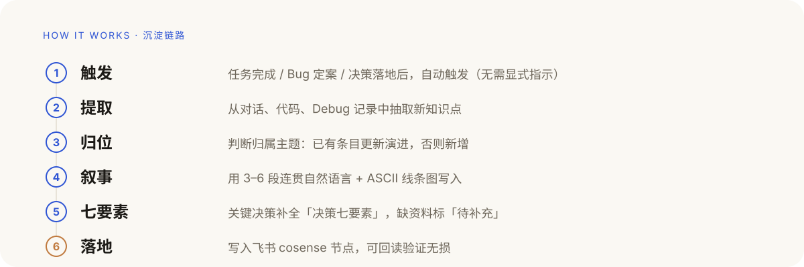

<p align="center">
  
</p>

**常驻 IDE 的项目复盘与面试知识引擎。** 在开发对话、Debug、架构设计、技术选型的过程中，它持续提取项目知识，把碎片化的上下文逆向重建成完整的工程脉络，沉淀为「能讲出来、能复述出来」的连贯叙事，直接用于项目复盘与面试递进式盘问。

> 「做了什么」只是结果，「当初怎么想、为什么这么选、放弃了什么」才是面试真正要考的东西。

## 它解决了什么

面试考的不是「你做了什么」，而是「你为什么这么做」。但决策的理由、放弃的备选、踩过的坑，往往散落在对话、代码和 Debug 记录里，事后很难还原。

Project Retrospective 在**任务完成、Bug 定案、决策落地**后自动触发，把这些碎片沉淀成结构化的项目知识，而不是等你事后凭记忆拼凑。

## 沉淀什么

| 分类 | 沉淀要点 |
| --- | --- |
| 系统架构 | 分层 / 模块边界 / 依赖方向（配线条架构图） |
| 核心链路 | 端到端请求流、事件流、状态机（配线条流程图） |
| 数据 Schema | 关键实体、表 / 字段、关系、索引、迁移决策 |
| 技术选型 | 每个关键决策按「决策七要素」记录 |
| 历史 Bad Case | 症状、根因、修复、可复用教训 |
| Trade-off | 取舍双方、为何选 A、放弃 B 的代价 |
| 性能指标 | P50 / P95 / P99、QPS、TTFT 等实测数据 |
| 架构演进 | 旧 → 新的迁移路径、中间态、主路 / 旁路 |

## 如何工作

<p align="center">
  
</p>

知识**直接落地到飞书知识库**（cosense 节点下），不落本地；写完可回读验证中文与线条字符无损。

## 决策七要素

每个关键技术决策用七要素记录，缺资料的标「待补充」，不编造：

1. **背景** — 当时面临什么问题 / 业务诉求
2. **约束** — 成本、性能、团队规模、迁移、兼容等硬限制
3. **候选方案** — 罗列 A / B / C（哪怕只是脑内对比）
4. **选择依据** — 为何选 X（尽量给出可量化对比）
5. **实现** — 落地方式、关键文件 / 代码、踩的坑
6. **结果** — 上线后效果、性能数据、是否达成预期
7. **遗留问题** — 未解决、可改进、未来风险

## 叙述风格

禁止纯 bullet 堆砌。每条知识用 **3–6 段连贯自然语言**写成，让读者能「讲出来、复述出来」；涉及架构、链路、状态机时必配 ASCII 线条图。

一段话的标准节奏：**背景为什么存在 → 核心难点 / 矛盾 → 怎么解决 → 结果与代价 → 踩过的坑**。

## 快速开始

1. 把仓库放到 Claude Code 的 skills 目录：

   ```bash
   git clone https://github.com/ttsdj/project-retrospective.git ~/.claude/skills/project-retrospective
   ```

2. 把 `SKILL.md` 里写死的飞书 `space_id` / 节点 token 换成你自己的知识库（`lark-cli` 用法见 [reference.md](reference.md)）。

3. 直接开发即可。任务完成、Bug 定案、决策落地后自动触发沉淀；也可以主动说「沉淀 / 复盘一下」。

## 知识库结构

知识库按主题落在飞书 cosense 节点下，每个主题一个子文档，标题带 `NN-` 序号：

| 文档 | 内容 |
| --- | --- |
| `00-项目复盘总览` | 定位、业务、分层、技术栈，一句话讲清「做什么 + 怎么做」 |
| `01-系统架构` | 各子系统架构图 + 段落说明，记录架构演进 |
| `02-核心链路` | 端到端请求流、事件流、状态机 |
| `03-数据Schema` | 实体、表 / 字段、关系、索引、迁移决策 |
| `04-技术选型` | 每个选型的「决策七要素」 |
| `05-BadCase` | 症状、根因、修复、可复用教训 |
| `06-权衡Tradeoff` | 取舍双方、代价、为什么接受 |
| `07-性能指标` | P50 / P95 / P99、QPS、TTFT |
| `08-面试盘问` | 递进式追问、高频问题 + 参考答案 |

## 文件

- [SKILL.md](SKILL.md) — 主规则：触发时机、知识分类、叙述风格、图例规范、决策七要素、写入流程。
- [reference.md](reference.md) — 渐进披露层：文件结构、模板细则、维护规则、面试盘问用法。
